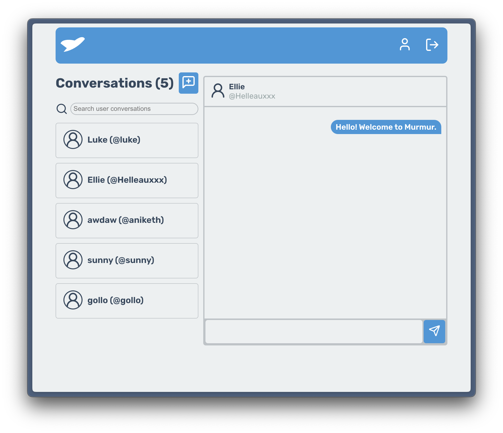

# Murmur.Chat - Front-end
This repo is for the front-end for my full-stack messaging app. 

For the backend of Murmur, please check out [the repo for it here](https://github.com/NewRedRoses/murmur-backend).

## Technologies used 

- This project is primairly using:
  - **React**: User interface & component design.
  - **Vite**: Build tool
  - **Axios**: HTTP requests to backend.
  - **Figma**: User interface design.
  - **Lucide** : Icons.

## Roadmap

To be disclosed. 

